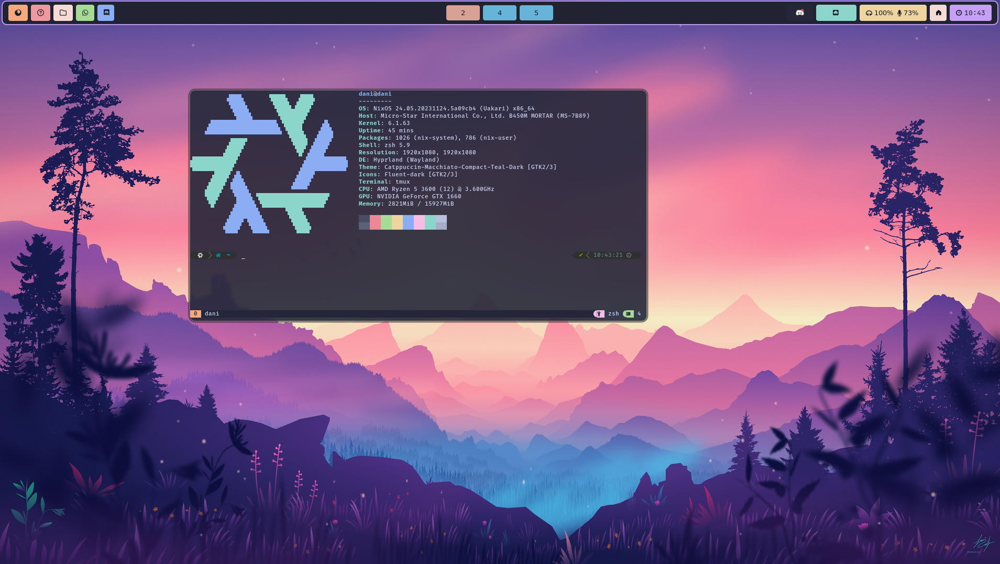

# NixOS home-manager dotfiles

<p align="center">
    
</p>

<p align="center">
    <a href="https://nixos.org/">
        
    </a>
    <a href="https://github.com/DaniFdz/dotfiles/stargazers">
		
	</a>
    
</p>

---

## For NixOS systems
Enable flakes:
```bash
export NIX_CONFIG="experimental-features = nix-command flakes"
```
Rebuild system with specific configurations:
```bash
sudo nixos-rebuild switch --flake github:DaniFdz/dotfiles#gnome
```

## For wsl NixOS
First download the [latest release](https://github.com/nix-community/NixOS-WSL/releases/tag/23.5.5.2)

Then open a terminal and run:
```ps1
wsl --import NixOS .\NixOS\ nixos-wsl.tar.gz --version 2
wsl -d NixOS
```

After the initial installation, you need to update your channels once, to be able to use `nixos-rebuild`:
```bash
nix-channel --update
```

To build the system type:
```bash
nixos-rebuild switch --flake github:DaniFdz/dotfiles#wsl
```

